# HR Policy Agent - Architecture Diagram

## System Architecture

```mermaid
graph TB
    subgraph "User Layer"
        User[👤 User/Developer]
    end
    
    subgraph "Agent Layer"
        Agent[🤖 HR Policy Agent<br/>hr_policy_agent.py]
        LangGraph[🔄 LangGraph ReAct Agent]
        LLM[🧠 ChatOllama<br/>llama3.1]
    end
    
    subgraph "MCP Layer"
        MCPClient[📡 MCP Client Session<br/>stdio_client]
        MCPServer[🖥️ MCP Server<br/>hr_policy_mcp_server.py<br/>FastMCP]
        
        subgraph "MCP Server Components"
            Tool[🔧 Tool: query_policies]
            Prompt[📝 Prompt: get_llm_prompt]
            VectorStore[🗄️ InMemory Vector Store]
            Embeddings[🔢 HuggingFace Embeddings<br/>all-MiniLM-L6-v2]
        end
    end
    
    subgraph "Data Source"
        PDF[📄 HR Policy Document<br/>hr_policy_document.pdf]
    end
    
    %% User to Agent
    User ==>|1. Submit Query| Agent
    Agent ==>|8. Return Response| User
    
    %% Agent to MCP Client
    Agent ==>|2. Initialize & Connect| MCPClient
    Agent ==>|3. Load Tools & Prompts| MCPClient
    
    %% MCP Client to Server
    MCPClient <==>|stdio transport| MCPServer
    
    %% Agent Layer Internal
    Agent ==>|4. Create Agent with Tools| LangGraph
    LangGraph ==>|5. Send Prompt| LLM
    LLM ==>|6. Tool Call Decision| LangGraph
    
    %% Tool Execution
    LangGraph ==>|7a. Execute query_policies| Tool
    Tool ==>|7b. Semantic Search| VectorStore
    VectorStore ==>|7c. Return Chunks| Tool
    Tool ==>|7d. Results| LangGraph
    
    %% Final Synthesis
    LangGraph ==>|7e. Synthesize| LLM
    LLM ==>|7f. Final Answer| LangGraph
    
    %% MCP Server Initialization (happens at startup)
    PDF -.->|Load & Split| MCPServer
    MCPServer -.->|Create Embeddings| Embeddings
    Embeddings -.->|Build Index| VectorStore
    
    %% Styling
    style User fill:#e1f5ff,stroke:#0066cc,stroke-width:3px
    style Agent fill:#fff4e1,stroke:#ff9900,stroke-width:3px
    style LangGraph fill:#fff4e1,stroke:#ff9900,stroke-width:3px
    style LLM fill:#ffe1f5,stroke:#cc0066,stroke-width:3px
    style MCPClient fill:#e1ffe1,stroke:#009900,stroke-width:3px
    style MCPServer fill:#e1ffe1,stroke:#009900,stroke-width:3px
    style Tool fill:#f5e1ff,stroke:#6600cc,stroke-width:3px
    style Prompt fill:#f5e1ff,stroke:#6600cc,stroke-width:3px
    style VectorStore fill:#ffe1e1,stroke:#cc0000,stroke-width:3px
    style Embeddings fill:#ffe1e1,stroke:#cc0000,stroke-width:3px
    style PDF fill:#f0f0f0,stroke:#666666,stroke-width:3px
    
    linkStyle 0,1,2,3,4,5,6,7,8,9,10,11,12,13 stroke:#333,stroke-width:3px
    linkStyle 14,15,16 stroke:#999,stroke-width:2px,stroke-dasharray:5
```

## Component Details

### 1. **User Layer**
- **User/Developer**: Initiates queries about HR policies

### 2. **Agent Layer**
- **HR Policy Agent** (`hr_policy_agent.py`): Main orchestrator
  - Manages async workflow
  - Initializes MCP client connection
  - Loads tools and prompts from MCP server
  
- **LangGraph ReAct Agent**: Reasoning and action framework
  - Implements ReAct (Reasoning + Acting) pattern
  - Decides when to call tools
  - Synthesizes final responses
  
- **ChatOllama (llama3.1)**: Local LLM
  - Processes natural language
  - Makes tool-calling decisions
  - Generates human-readable responses

### 3. **MCP Layer**
The MCP layer is responsible for document processing, vector storage, and exposing tools/prompts.

- **MCP Client Session**: 
  - Establishes stdio-based communication
  - Manages session lifecycle
  - Loads tools and prompts dynamically from server
  
- **MCP Server** (`hr_policy_mcp_server.py`):
  - Built with FastMCP framework
  - Runs as separate process (via `uv run`)
  - **Initialization**: Loads PDF, creates embeddings, builds vector store
  - **Runtime**: Exposes tools and prompts to agent
  
- **MCP Server Components**:
  - **Tool: `query_policies`**:
    - Performs semantic search on vector store
    - Returns top-k (k=3) relevant policy chunks
  
  - **Prompt: `get_llm_prompt`**:
    - Dynamically generates system prompt
    - Instructs LLM to use only provided tools
    - Prevents hallucination
  
  - **HuggingFace Embeddings**: Converts text to 384-dim vectors
    - Model: `sentence-transformers/all-MiniLM-L6-v2`
    - Used for both document indexing and query embedding
  
  - **InMemory Vector Store**: Enables semantic search
    - Built from PDF document chunks at server startup
    - Performs similarity search during query execution

### 4. **Data Source**
- **HR Policy Document**: Source PDF file (`hr_policy_document.pdf`)
  - Loaded by MCP server at initialization
  - Split into chunks using PyPDFLoader
  - Embedded and indexed in vector store

## Data Flow

1. **Initialization Phase**:
   - Agent starts MCP server as subprocess
   - Establishes stdio connection
   - MCP server loads PDF and builds vector store
   - Agent retrieves available tools and prompts

2. **Query Phase**:
   - User submits query
   - Agent loads dynamic prompt with query
   - Agent invokes LangGraph ReAct agent

3. **Reasoning Phase**:
   - LLM receives prompt and available tools
   - LLM decides to call `query_policies` tool
   - Tool performs semantic search in vector store
   - Returns relevant policy chunks

4. **Synthesis Phase**:
   - LLM receives tool results
   - Generates natural language response
   - Agent returns final answer to user

## Technology Stack

| Layer | Technologies |
|-------|-------------|
| **Agent Framework** | LangGraph, LangChain |
| **MCP** | FastMCP, MCP SDK |
| **LLM** | Ollama (llama3.1) |
| **Embeddings** | HuggingFace Transformers |
| **Vector Store** | LangChain InMemoryVectorStore |
| **Document Processing** | PyPDFLoader |
| **Communication** | stdio (Standard I/O) |
| **Runtime** | Python, asyncio, uv |

## Key Design Patterns

1. **Model Context Protocol (MCP)**: Standardized tool and prompt interface
2. **ReAct Pattern**: Reasoning and Acting in iterative loop
3. **RAG (Retrieval-Augmented Generation)**: Semantic search + LLM synthesis
4. **Async/Await**: Non-blocking I/O operations
5. **Separation of Concerns**: Agent, MCP server, and data layer are decoupled
