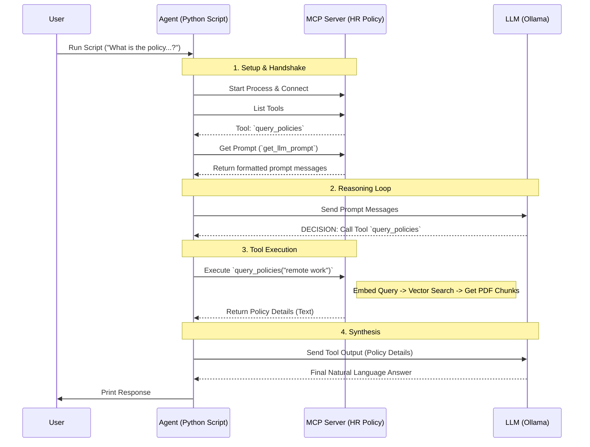

```mermaid
sequenceDiagram
    participant User
    participant Agent as Agent (Python Script)
    participant MCP as MCP Server (HR Policy)
    participant LLM as LLM (Ollama)

    User->>Agent: Run Script ("What is the policy...?")
    
    Note over Agent, MCP: 1. Setup & Handshake
    Agent->>MCP: Start Process & Connect
    Agent->>MCP: List Tools
    MCP-->>Agent: Tool: `query_policies`
    Agent->>MCP: Get Prompt (`get_llm_prompt`)
    MCP-->>Agent: Return formatted prompt messages

    Note over Agent, LLM: 2. Reasoning Loop
    Agent->>LLM: Send Prompt Messages
    LLM-->>Agent: DECISION: Call Tool `query_policies`
    
    Note over Agent, MCP: 3. Tool Execution
    Agent->>MCP: Execute `query_policies("remote work")`
    Note right of MCP: Embed Query -> Vector Search -> Get PDF Chunks
    MCP-->>Agent: Return Policy Details (Text)
    
    Note over Agent, LLM: 4. Synthesis
    Agent->>LLM: Send Tool Output (Policy Details)
    LLM-->>Agent: Final Natural Language Answer
    
    Agent->>User: Print Response
```